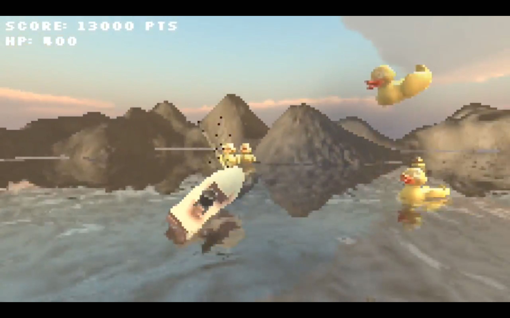

# Battle of Ossinlampi

Once in the not so distant past there was a pond far far north in the province of Otaniemi. One brave battleship set out to defend the beloved pond from the attack of the evil rubber ducks. Armed with two machine guns and one heavy cannon the ship sets sail towards victory. The Battle of Ossinlampi is a mobile 3D game made with Unity utilising accelerometer and voice controls. The ship is controlled by rotating the phone, while the heavy cannon uses voice commands for input.

## Team

- Veeti Haapsamo
- Olli Niskanen
- Joonas Nissinen

## Unity Version

Developed with Unity version 5.5.0f1.

## Plugins

- UniRx
